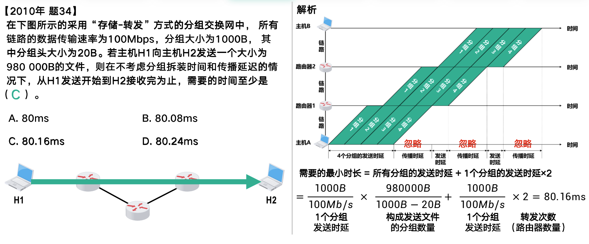

# 计算机网络期末复习

> 日期：2024-1-2
>
> 作者：cqq

### 题型

1. 填空题（10×2‘=20’）
2. 选择题（10×2‘=20‘）
3. 简答题（3×10‘=30’）
4. 计算题（2×10‘=20‘）
5. 论述题（1×10‘=10’）

重点思维导图

说明：

> ★为重点。如果加粗小点，则该小点为重点，如果加粗大点，则该部分都重要；加粗为提炼
>
> 刷题参考课后习题与往年试卷

### 第1章	概述

1. 计算机网络

   - 说明：互联网是一种远程分组交换网络，所以采用的是**分组交换**技术。
   
   
      - 定义
   
        - 由自治的**计算机互联**起来的**集合体**。
   
        - 计算机网络由**若干结点**和连接这些**结点的链路**组成。
   
           > 网络中的结点可以是计算机、集线器、交换机或路由器等。
   
        - 由一些通用的、可编程的**硬件互连而成**的
   
2. 互联网的两大组成部分的特点是什么？它们的工作方式各有什么特点？

   - 边缘部分：由所有连接在互联网上的**主机组成**。这部分是用户直接使用的，用来进行**通信和资源共享**。
   - 核心部分：由大量**网络**和连接这些网络的**路由器**组成。这部分是为边缘部分提供服务的。
   - 在网络**边缘部分**的端系统之间的通信方式通常可划分为两大类：**客户—服务器方式（C/S方式）**和**对等方式（P2P方式）**。**核心部分**的工作方式也有两种：一种是**路由器转发分组**，另一种是**路由器之间不断地交换路由信息**。

3. 交换技术★

   - 电路交换

      - 定义
        - **电话交换机接通电话线的方式**称为电路交换
        - 从通信资源的分配角度来看，交换就是按照某种方式动态地分配传输线路的资源
      - 步骤：建立连接（分配通信资源）=> 通话（始终占用通信资源）=> 释放连接（归还通信资源）
      - 特点：整个报文的比特流连续地从源点直达终点，好像在一个管道中传送。
      - 优点
        - **通信时延小**。通信双方通过专用线路进行通信，数据可以直达。当数据传输量较大时，优点将十分显著。
        - **线路独占**，没有冲突。
        - **实时性强**。一旦通信线路建立，双方可以实时通信。
      - 缺点
        - 线路独占，**利用率太低**。
        - 连接**建立时间过长**。

   - 报文交换

      - 特点：整个报文先传送到相邻结点，全部存储下来后查找转发表，转发到下一个结点。（存储转发）
      - 优点
        - **无需**建立连接。
        - **动态分配**线路。
        - 线路**利用率高**。
      - 缺点
        - 报文交换对报文的大小没有限制，需要网络节点**有足够的缓存空间**。
        - 报文交换在节点处要经历存储、转发等操作，从而引起**一定时延**。

   - 分组交换

      - 步骤：把一个报文**划分为几个分组**后再进行传送。
      - 特点★：存储转发、分段重组和独立选路
        - 节点暂时**存储**的是一个个**分组**，而**不是整个报文**；
        - 分组暂时**保存在节点的内存**中，保证了较高的交换速率；
        - 采用**存储转发技术**；
        - **动态分配线路**，极大的提高了通信线路的利用率。
      - 优点
        - **高效**：在分组传输的过程中动态分配传输带宽，对通信链路是逐段占用
        - **灵活**：为每一个分组独立地选择最合适的转发路由
        - **迅速**：以分组作为传送单位，不先建立连接就能向其他主机发送分组
        - **可靠**：保证可靠性的网络协议，分布式多路由的分组交换网，使网络有很好的生存性
      - 缺点
        - 分组在节点转发时因排队而造成一定的**延时**
        - 由于分组交换不像电路交换那样通过建立连接来保证通信时所需的各种资源，因而**无法确保通信时端到端所需的带宽**
        - 分组必须**携带一些控制信息(首部)而产生额外开销**，整个分组交换网需要专门的管理和控制机制（管理控制比较困难）
        - 当分组采用数据报服务时，**分组可能出现失序、丢失或重复**。

   - 三种交换技术之间的比较

      

      - 若要连续传送大量的数据，且其传送时间远大于连接建立时间，则**电路交换**的传输速率较快。
      - **报文交换**和**分组交换**不需要预先分配传输带宽，在传送突发数据时可提高整个网络的信道利用率。
      - 由于一个分组的长度往往远小于整个报文的长度，因此**分组交换**比报文交换的**时延小**，同时也具有**更好的灵活性**。

4. 计算机网络的分类

   - 按作用范围：广域网WAN、城域网MAN、局域网LAN、个人区域网PAN等
   - 按使用者：公用网、专用网

5. 计算机网络的性能指标

   - 速率★：数据的传送速率，也称为数据率或比特率。单位（**bit/s**或写作b/s、bps）k->M->G->T->P

      > 说明：按1000倍进行计算而不是1024倍
      >
      > 举例
      >
      > ​	数据量：$1$ GB = $1×2^{10}$ MB= $1×2^{20}$ KB= $1×2^{30}$ Byte = $8×2^{30}$ Bit，每一级 $2^{10}$
      >
      > ​	速率：$8$ Gbit/s = $8×10^{3}$ Mbit/s= $8×10^{6}$ kbit/s= $1×10^{9}$Byte/s = $8×10^{9}$ bit/s，每一级 $10^{3}$

   - 带宽：通道传送数据的能力，表示单位时间内网络中某信道所能通过的“最高数据率”。单位（**bit/s**）

   - 吞吐量：表示在单位时间内通过某个网络（或信道、接口）的实际数据量。单位（**bit/s**）

   - 时延★：指数据从网络的一端传送到另一端所需的时间。

      - 发送（传输）时延：主机或路由器发送数据帧所需要的时间，从发送数据帧的第一个比特算起，到该帧最后一个比特发送完毕所需的时间。
        
        > 发送时延 = 数据帧长度（bit）/ 发送速率（bit/s）
        
      - 传播时延：电磁波在信道中需要传播一定的距离而花费的时间。
        
        > 传播时延 = 信道长度（米）/ 信号在信道上的传播速率（米/秒）
        
      - 处理时延：主机或路由器在收到分组时要花费一定的时间进行处理所花费的时间。

      - 排队时延：分组在经过网络传输时，要经过许多路由器，分组在进入路由器后要先在输入队列中排队等待处理的时间。

      - 总时延=发送时延+传播时延+处理时延（一般不处理）+排队时延（一般不处理）
        

   - 时延带宽积★：时延带宽积 = 传播时延 * 带宽，又称以比特为单位的链路长度。

   - 往返时间RTT：往返时间表示从发送方发送数据开始，到发送方收到来自接收方的确认，总共经历的时间。

      > 影响因素：**链路的传播时间、末端系统的处理时间以及路由器的排队时间**。
      >
      > RTT的变化主要由路由器的排队时间影响，因此RTT反映了网络拥堵程度的变化。
      >
      > 有效数据率 = 数据长度(bit) / (发送时间+RTT)(s)

   - 利用率

      - 分类

        - 信道利用率：指出某信道有百分之几的时间是被利用的（有数据通过）。完全空闲的信道的利用率是零。
        - 网络利用率：全网络的信道利用率的加权平均值。

      - 概念解析：信道利用率或网络利用率过高就会产生非常大的时延。（一般控制不超过50%）

      - 计算公式：若令 $D_0$ 表示网络空闲时的时延，$D$ 表示网络当前的时延，则在适当的假定条件下，可以用下面的简单公式表示 $D$ 和 $D_0$之间的关系。其中：$U$ 是网络的利用率，数值在 0 到 1 之间。

        > 说明：信道利用率**并非越高越好**。当某信道的利用率增大时，该信道引起的时延也就迅速增加。
        >
        > $D = D_0 / (1 - U)$

6. 计算机网络的非性能指标

   ①费用②质量③标准化④可靠性⑤可扩展性和可升级性⑥易于管理与维护

7. 计算机网络体系结构★：OSI七层协议体系结构、TCP/IP四层体系结构和OSI五层体系结构

   

     1. 应用层：通过**应用进程间的交互**来完成特定网络应用。应用层交换的数据单元为**报文**。
     2. 运输层：负责向**两台主机中进程之间的通信**提供**通用的数据传输**服务。有TCP和UDP两种协议。
        - 传输控制协议TCP：提供**面向连接的、可靠的**数据传输服务，其数据传输的单位是**报文段**。
        - 用户数据报协议UDP：提供**无连接的尽最大努力的**数据传输服务（不保证数据传输的可靠性），其数据传输的单位是**用户数据报**。
     3. 网络层：负责**为分组交换网上的不同主机提供通信服务**。发送数据时，网络层把运输层产生的报文段或用户数据报封装成**分组或包**进行传送。由于网络层使用IP协议，因此分组也叫做**IP数据报、数据报**。
     4. 数据链路层：在两个相邻节点之间传送数据时，数据链路层将网络层交下来的**IP数据报组装成帧**，在两个相邻节点间的链路上传送帧。传送的单位是**帧**。
     5. 物理层：**传输比特流数据**。单位为**比特**。
     6. 分层的优缺点
        - 优点
          - 各层之间是**独立**的
          - 灵活性好
          - 结构上**可分割开**
          - 易于实现和**维护**
          - 能促进标准化工作
        - 缺点
          - 降低效率
          - 有些功能会在不同的层次中重复出现，因而**产生了额外开销**

8. 协议

   - 定义★：又称网络协议，是为进行网络中的**同层对等实体**数据交换而建立的规则、标准或约定的集合。
   - 三要素★
     - 语法：定义所交换信息的**格式**
     - 语义：定义通信双方所要完成的**操作**
     - 同步：定义通信双方的**时序关系**
   - 协议与服务的区别与联系
     - 协议的实现**保证了能够向上一层提供服务**。在协议的控制下，两个对等实体间的通信使得本层能够向上一层提供服务。
     - 本层的服务用户只能看见服务而无法看见下面的协议。即**下面的协议对上面的服务用户是透明的**。
     - 协议是“水平的”，即**协议是控制对等实体之间通信的规则**。服务是“垂直的”，即**服务是由下层向上层通过层间接口提供的**。
     - 上层**使用服务原语**获得下层所提供的服务来实现上层协议。

------

### 第2章	物理层

1. 消息、信息、信号区别

   - 消息：具体的、非物理的
   - 信息：非具体的、非物理的
   - 信号：具体的、物理的
   - 说明：同一信息，可以采用不同形式的物理量来载荷（信号），也可以采用不同的表现形式（消息）。同样，同一类型信号或消息也可以代表不同内容的信息

2. 功能★

   - 在连接各种计算机的传输媒体上**传输数据比特流**
   - **屏蔽不同传输媒体和通信手段的差异**，使数据链路层只需要考虑如何完成本层的协议和服务，而不必考虑网络具体的传输媒体是什么
   - 为数据链路层**提供物理连接**

3. 特性★

   - **机械特性**：指明接口所用接线器的形状和尺寸、引脚数目和排列、固定和锁定装置等。

   - **电气特性**：指明在接口电缆的各条线上出现的电压的范围。
   - **功能特性**：指明某条线上出现的某一电平的电压的意义。
   - **过程特性**：指明对于不同功能的各种可能事件的出现顺序。

4. 通信双方信息交互的主要方式

   - 单向通信（单工通信）：只能有一个方向的通信而没有反方向的交互。
   - 双向交替通信（半双工通信）：通信的双方都可以发送信息，但不能双方同时发送或接受。
   - 双向同时通信（全双工通信）：通信的双方可以同时发送和接收信息。

5. 调制

   - 基带调制

     - 定义：仅对基带信号的**码形**进行**变换**，使它能够与信道特性相适应。变换后的信号**仍然是基带信号**。 把这种过程称为**编码**。

     - 编码方式★

       

   - 带通调制

     - 定义：使用**载波**进行调制，把基带信号的频率范围搬移到**较高的频段**，并转换为**模拟信号**， 这样就能够更好地在模拟信道中传输（即仅在一段频率范围内能够通过信道）

     - 二元制调节方式

       

6. 数据信号传输方式

   - 频带传输：把**数字信号调制成音频信号**（是模拟信号，在模拟信道上传输）后再发送和传输，到达时再将音频信号**解调成原来的数字信号**，如利用电话交换网与调制解调器进行数据传输。
   - 宽带传输：将信道分成多个子信道，分别传送音频、视频和数字信号，**使不同的信道进行并行传输**。
     一个宽带信道可被分为多个逻辑基带信道，进行**多路复用**。实质上是相对一般频带传输而言的宽频带传输，宽带传输采用**频带传输技术**。
   - 基带传输：利用**数字通信信道**原封不动地传输由计算机或终端产生的0或1数字脉冲信号的方法称为基带传输。**适用于近距离传输**。

7. 比特速率和码元速率

   - QAM：又称正交双边带调制。在多电平时，就构成了多进制正交幅度调制（MQAM）

   - 基本公式（数据通信内容）★：
     
     - 比特速率和码元速率的关系
       $$
       N_b = N_{baud}log_2M
       $$
     
       - 说明：其中 $N_b$ = $f_b$ = 比特速率，$N_{baud}$ = $f_s$ = 码元速率（波特率，单位时间内传送的**码元符号的个数**），$M$ = 进制数（有效离散值）
     
     - 电平数：在**计算机网络**里若有$X$个相位，$Y$种振幅，则$M=XY$
     - 码元比特数：$k=log_2M=log_2XY$
     - 带宽：$B$

8. 信道的极限速率★

   - 影响信道最大传输速率的因素：①信道能够通过的**频率范围**②**信噪比**

   - 奈氏准则：在带宽为W(Hz)的低通信道中，若不考虑噪声影响则码元传输的最高速率是**2W（码元/秒）**。

   - 信噪比(dB) = $10log_{10}(\frac{S}{N})$，S/N即信号的平均功率和噪声的平均功率之比

   - 香农公式：设带宽为$W$，信噪比为$S/N$，信道的极限信息传输速率$C=Wlog_2(1+\frac{S}{N})(bit/s)$。

   - **需要注意2W单位是码元/秒，香农公式是bit/s**
     
     > 若链路带宽为3kHz，采用4个相位、每个相位有4种振幅的QAM调制，则链路的最大传输速率
     > $f_s=2W=6k$（码元/秒），$n=4*4$，故$f_b=f_s*log_2n=6k*4=24kbit/s$
     
   - 香农公式的意义：告诫工程人员，在有噪声的实际信道上，**不论采用多么复杂的编码技术，都不可能突破公式给出的信息传输速率的绝对极限**。

9. 信道利用技术

   - 频分复用 FDM (Frequency Division Multiplexing)

     

     - 原理★

       - 将整个带宽分为多份，用户在分配到一定的频带后，在通信过程中**自始至终都占用这个频带**。

       - **频分复用**的所有用户在同样的时间**占用不同的带宽资源**（这里的“带宽”是频率带宽而不是数据的发送速率）。

     - 优点：**信道复用率高**，分路方便；

     - 缺点：各路信号之间存在**相互干扰**（串扰）

   - 时分复用 TDM (Time Division Multiplexing)

     

     - 原理★
       - **时分复用**则是将时间划分为一段段等长的**时分复用帧（TDM帧）**。每一个时分复用的用户在每一个 TDM 帧中占用固定序号的时隙。
       - 每一个用户所占用的时隙是**周期性地出现**（其周期就是TDM帧的长度）的。
     - 优点：**简单**，易于大规模集成，信号间不串话。
     - 缺点：所有用户在不同的时间占用同样的频带宽度，可能会造成**线路资源的浪费**。

   - 统计时分复用 STDM (Statistic TDM)

     

     - 原理★：使用STDM帧来传送复用的数据，根据用户实际需要**动态分配时长**。（可能会有间隙）

   - 波分复用 WDM(Wavelength Division Multiplexing)

     

     - 原理★
       - 波分复用就是**光的频分复用**。使用一根光纤来同时传输多个光载波信号。
       - 整个波长频带被划分为若干个波长范围，每个用户**占用一个波长范围**来进行传输。
     - 优点：结构小，简单可靠；**充分利用光纤带宽资源**；**透明的传输通道**；更灵活地进行光纤通信组网。
     - 缺点：存在**插入损耗**和**串光问题**。

   - 码分复用

     - 原理★：将每个比特时间划分为m个更短的时间片，称为码片（m通常取值为64/128），每个站点都被指派一个唯一的**m比特码片序列**。若某个站要发送比特1，则发送它自己的m比特码片序列；若要发送0，则发送它自己的m比特码片序列的反码。

     - 特点

       - 各用户使用经过特殊挑选的不同码型，因此**彼此不会造成干扰**。
       - 这种系统发送的信号有**很强的抗干扰能力**，其频谱类似于白噪声，不易被敌人发现。
       - 每个用户可在同一时间内使用同样的频带进行通信，但使用的是基于码型的**分割信道**的方法。

     - 计算★

       - 原理：向量叠加，发送A+B+C...（向量加法）

       - 举例

         > 1. 共有4个站进行码分多址通信。4个站的码片序列为
         >    A：（－1－1－1＋1＋1－1＋1＋1）
         >    B：（－1－1＋1－1＋1＋1＋1－1）
         >    C：（－1＋1－1＋1＋1＋1－1－1）
         >    D：（－1＋1－1－1－1－1＋1－1）
         >    现收到这样的码片序列S：（－1＋1－3＋1－1－3＋1＋1）。
         >    问哪个站发送数据了？发送数据的站发送的是0还是1？
         >
         >    S•A=（＋1－1＋3＋1－1＋3＋1＋1）／8=1， A发送1
         >    S•B=（＋1－1－3－1－1－3＋1－1）／8=－1， B发送0
         >    S•C=（＋1＋1＋3＋1－1－3－1－1）／8=0， C无发送
         >    S•D=（＋1＋1＋3－1＋1＋3＋1－1）／8=1， D发送1
         >
         > 2. 站点1、2、3通过CDMA共享链路。站点1、2、3的码片序列分别是
         >    A：（1，1，1，1）、B：（1，-1，1，-1）和C：（1，1，-1，-1），
         >    若站3从链路上收到的序列S是(2,0,2,0, 0,-2,0,-2, 0,2,0,2)，则站点3收到站点1发送的数据是多少？
         >
         >    S•A=（2+0+2+0）/ 4=1，（0-2+0-2）/ 4=-1，（0+2+0+2）/ 4=1，A发送1 0 1
         >
         >    S•B=（2+0+2+0）/ 4=1，（0+2+0+2）/ 4=1，（0-2+0-2）/ 4=-1，B发送1 1 0
         >
         >    S•C=（2+0-2+0）/ 4=0，（0-2+0+2）/ 4=0，（0+2+0-2）/ 4=0，C无发送

------

​     

### 第3章	数据链路层

1. 数据链路层的功能：在两个网络实体之间提供**数据链路连接的创建、维持和释放管理**。数据链路提供的是一种无连接的最大努力交付的服务，即**无连接不可靠**的服务。

2. 数据链路层使用的两种信道及对应协议

   - 点对点信道：使用一对一的点对点通信方式，使用**点对点协议PPP**。
   - 广播信道：使用一对多的广播通信释放，使用专用的**共享信道协议CSMA/CD协议**。

3. 数据链路层的三个基本问题（原因、解决方法）★

   - 封装成帧

     - 定义★：封装成帧就是在一段数据前后分别添加首部和尾部。接收端以便从收到的比特流中识别帧的开始与结束，**帧定界是分组交换的必然要求**。
     - 原因/作用
       - 识别**帧的开始与结束**
       - 便于**计算机识别**和**处理比特流**
       - 向上层提供**比特丢失、比特错误**等服务
       - 方便传输
     - 解决方案：**帧定界**。使用特殊的帧定界符，控制字符SOH（0x01）放在一帧的最前面，表示帧的首部开始；另一外控制字符EOT（0x04）表示帧的结束。

   - 透明传输

     - 透明的定义：某一个实际存在的事物看起来却好像不存在
     - 原因
       - 避免**消息符号**与**帧定界符号**相混淆
       - 如果数据中的某个字节的二进制代码恰好和帧定界符一样就会出现**帧定界错误**。
     - 解决方案★
       - 异步：面向**字节**的物理链路使用**字节填充或字符填充**
          - 发送端的数据链路层在数据中出现控制字符“SOH”(Start Of Header)或 “EOT”(End Of Transmission)或转义字符"ESC"的前面插入一个**转义字符“ESC”** (其十六进制编码是 1B)。
          - 接收端的数据链路层在将数据送往网络层之前删除控制字符前插入的转义字符和两个转义字符中前面的那一个。
       - 同步：面向**比特**的物理链路使用**比特填充**

   - 差错检测

     - 原因

       - 防止差错的无效数据帧，浪费网络资源
       - 传输过程中可能会产生**比特差错**（是传输差错中的一种）：1 可能会变成 0 而 0 也可能变成 1。

     - 误码率：在一段时间内，**传输错误的比特占所传输比特总数的比率**，与信噪比有很大的关系（正相关）。

     - 解决方案：**循环冗余检验CRC**★

       - 步骤

         1. 收发双方约定好一个生成多项式G(x);
         2. 发送方基于待发送的数据和生成多项式计算出差错检测码/循环冗余校验码（冗余码），将其添加到待传输数据的后面一起传输;
         3. 接收方通过生成多项式来计算收到的数据是否产生了误码;
            - 若得出的余数 **R = 0**，则判定这个帧**没有差错**，就接受。
            - 若余数 **R ≠ 0**，则判定这个帧**有差错**，就丢弃。

       - 计算

         1. 用二进制的模 2 运算进行 $2^n$ 乘 $M$ 的运算，这相当于在 $M$ 后面添加 n 个 0。
         2. 得到的 $(k + n)$ 位的数除以事先选定好的长度为 $(n + 1)$ 位的除数 $P$，得出商是 $Q$ 而余数是 $R$， 余数 $R$ 比除数 $P$ 少 1 位，即 $R$ 是 n 位。
         3. 将余数 $R$ 作为冗余码拼接在数据 $M$ 后面发送出去。

       - 举例

         

4. PPP协议

   - 注意

     - 使用**点对点信道**

     - PPP 是**面向字节**的，所有的 PPP 帧的长度都是整数字节。

     - **基于IP通信**，不需要MAC地址

   - 组成★

     - 一个将 IP 数据报**封装到串行链路**的方法。
     - 链路控制协议 LCP (Link Control Protocol)：用来**建立、配置和测试**数据链路连接。
     - 网络控制协议 NCP (Network Control Protocol)：其中的每一个协议**支持不同的网络层协议**。

   - 同步传输★：一连串比特连续传送帧。必须建立准确时钟信号，各信号码元之间的**相对位置都是固定的**。

   - 异步传输★：**逐个字符传送**。需要在每一个字符的开始和结束的地方加上标志，即**加上起始码和停止码**。

   - 同步传输和异步传输的区别★

     |           指标           |  同步传输   |  异步传输  |
     | :----------------------: | :---------: | :--------: |
     |         传输方式         |  面向比特   |  面向字符  |
     |       透明传输方法       | 0比特填充法 | 字符填充法 |
     |         传输效率         |     高      |     低     |
     |      时钟精确度要求      |     高      |     低     |
     | 各信号码元之间的相对位置 |    固定     |   不固定   |

   - 三个基本问题

     - 帧格式（封装成帧）

       

       - 首部的第一个字段和尾部的第二个字段都是标志字段F(Flag，十六进制的7E的二进制表示是01111110)。标志字段表示一个帧的开始或结束。因此标志字段就是PPP帧的定界符。如果出现连续两个标志字段，就表示这是一个空帧，应当丢弃。
       - 首部中的地址字段A规定为0xFF(即11111111)，控制字段C规定为0x03(即00000011)。这两个字段实际上并没有携带PPP帧的信息。
       - PPP首部的第四个字段是2字节的协议字段
         - 若为0x0021，则信息字段就是IP数据报
         - 若为0xC021，则信息字段是PPP链路控制协议LCP的数据；
         - 若为0x8021，则信息字段是网络层的控制数据；
         - 若为0xC023，则信息字段是鉴别数据。
       - 信息字段的长度是可变的，不超过1500字节。
       - 尾部中的第一个字段(2字节)是使用CRC的帧检验序列FCS（Frame Check Sequence）。

     - 透明传输

       下面两者方法本质上都是为了避免帧定界错误（帧定界符为0x7E/0111 1110 B）。

       1. 当 PPP 用在**异步**传输时（传输单位为**字节**），就使用一种特殊的**字符填充**法。

          - 将信息字段中出现的每一个 0x7E 字节转变成为 2 字节序列 (0x7D, 0x5E)。
          - 若信息字段中出现一个 0x7D 的字节, 则将其转变成为 2 字节序列 (0x7D, 0x5D)。 
          - 若信息字段中出现 ASCII 码的控制字符（即数值小于 0x20 的字符），则在该字符前面要加入一个 0x7D 字节，同时将该字符的编码加上0x20。

          

       2. 当 PPP 用在**同步**传输链路时（传输单位为**比特**），协议规定采用硬件来完成**比特填充**。

          - 在发送端，只要发现有 5 个连续 1，则立即填入一个 0。
          - 接收端对帧中的比特流进行扫描。每当发现 5 个连续 1 时，就把这 5 个连续 1 后的一个 0 删除。

          

     - 差错检测

       

5. 适配器（网卡）

   - 定义：网络接口板又称为**通信适配器**或**网络接口卡**，或“**网卡**”。
   - 功能
     - 进行串行/并行转换。**计算机内部是并行通信，局域网是串行通信**。
     - 对数据进行**缓存**。
     - 在计算机的操作系统安装**设备驱动程序**。
     - 实现**以太网协议**。

6. CSMA/CD协议

   - 注意

     - 使用**广播信道**，可以进行一对多通信

     - 是**局域网**（以太网）采用的协议
   
   
      - 含义：CSMA/CD：载波监听 / 多点接入 / 碰撞检测。
   
        * “载波监听”是指每一个站在发送数据之前先要检测一下总线上是否有其他计算机在发送数据，如果有，则暂时不要发送数据，以免发生碰撞。
        
        - “多点接入”表示许多计算机以多点接入的方式连接在一根总线上。
        
         * “碰撞检测”就是计算机边发送数据边检测信道上的信号电压大小。
        
           * 当几个站同时在总线上发送数据时，总线上的信号电压摆动值将会增大（互相叠加）。
           * 当一个站检测到的信号电压摆动值超过一定的门限值时，就认为总线上至少有两个站同时在发送数据，表明产生了碰撞。
           
           > 在使用CSMA/CD协议时，一个站不可能同时进行发送和接收（但必须边发送边监听信道)。因此使用CSMA/CD 协议的以太网不可能进行全双工通信而只能进行**双向交替通信（半双工通信）**。
           
           
        
      - 流程★：**发前先听、边发边听、冲突停止、延后重传**（16字总结）
   
   
      - 争用期★（碰撞窗口）
   
        - 产生原因：最先发送数据帧的站，在发送数据帧后至多经过时间 $2 \tau$ （端到端往返时延）就可知道发送的数据帧是否遭受了碰撞。
   
        - 定义：以太网的端到端往返时延 $2 \tau$ 称为争用期（碰撞窗口）。
   
        - 计算公式：设最远两个站点之间的距离为d(m)，电缆中信号传播速度为v(m/s)。
   
           $\tau=\frac{d}{v}$ , 争用期 = $2 \tau$ 
   
        - 协议规定长度
   
          * 10 Mbit/s 以太网取 51.2 $\mu s$ 为争用期的长度。
   
          * 这意味着：
   
            1. 对于 10 Mbit/s 以太网，在争用期内可发送 512 bit，即 64 字节。
   
            2. 以太网在发送数据时，若前 64 字节没有发生冲突，则后续的数据就不会发生冲突。如果发生冲突，就一定是在发送的前 64 字节之内。
   
            3. 如果一检测到冲突就立即中止发送，这时已经发送出去的数据一定小于 64 字节。
   
               > 因此以太网规定了**最短有效帧长为 64 字节**，凡长度小于 64 字节的帧都是由于冲突而异常中止的无效帧。
   
   
      - 最短有效帧
   
        - 定义：设最远两个站点之间的距离为$d(m)$，最小帧长为$l(bit)$；最小帧长=争用期 $2 \tau$ x 数据传输速率$(bps)$。
   
          > 对于 10 Mbit/s 以太网，争用期= 51.2 $\mu s$ ，最小帧长= 51.2 x 10^-6^ x 10 x 10^6^ =512bit=64Byte
          >
          > 对于 100 Mbit/s 以太网，争用期= 5.12 $\mu s$ ，最小帧长= 5.12 x 10^-6^ x 100 x 10^6^ = 512bit=64Byte
        
        - 例题
        
          
   
   
      - 二进制指数类型退避算法
   
        - 意义：让发生碰撞的站在停止发送数据后推迟一段随机的时间才能再发送数据，**减少重传时发生冲突的概率**。
   
        - 内容
   
          
   
7. MAC 地址

   - 别名：MAC 层的硬件地址 / 硬件地址 / 物理地址。

   - 格式★

     

   - 帧长★：收到的帧的MAC客户**数据字段**的长度范围为**46-1500**字节之间（当数据字段的长度小于46字节时，会在数据字段的后面添加整数字节的填充字节），且MAC帧首部和尾部的长度共18字节，可以得出有效的**MAC帧**长度为**64-1518**字节之间。

   - 分类：分为**目的地址和源地址字段**

     > 本地网络上的主机通过硬件地址查找其它的网络设备

8. 网桥

   作用：把多个“局域网”连接起来，组成更大的局域网；根据 **MAC 帧的目的地址**对收到的帧进行**转发和过滤**。

   > 当网桥收到一个帧时，并不是向所有的接口转发此帧，而是先检查此帧的目的 MAC 地址
   >
   > 再确定将该帧转发到哪一个接口，或把它丢弃。

9. 交换机

   - 定义：交换式集线器 / 以太网交换机 / 第二层交换机

   - 功能：物理编址、网络拓扑结构、错误校验、帧序列以及流控

   - 注意：**总线以太网使用 CSMA/CD 协议**，以半双工方式工作。但**以太网交换机不使用共享总线**，没有碰撞问题，因此**不使用CSMA/CD协议**，而是以**全双工方式工作**。但由于它的帧结构未改变，仍然采用以太网的帧结构，所以仍称为以太网。

   - 交换方式

     * 存储转发模式：把整个数据帧**先缓存后再进行处理**。 
     * 直通模式：接收数据帧的同时就立即按数据帧的目的MAC地址决定该帧的转发接口，因而提高了帧的转发速度。缺点是它**不检查差错**就直接将帧转发出去，因此有可能也将一些无效帧转发给其他的站。

   - 特点

     * 以太网交换机实质上就是一个**多接口的网桥**。 每个接口都直接与一个单台主机或另一个以太网交换机相连。

     * 以太网交换机具有**并行性**，一般都工作在全双工方式。 能同时连通多对接口，使多对主机能同时通信。

     * 相互通信的主机都是**独占传输媒体**，无碰撞地传输数据。（隔离了冲突域）

     * 以太网交换机的接口**有存储器，**能在输出端口繁忙时把到来的帧进行缓存。

     * 以太网交换机是一种**即插即用**设备，其内部的帧交换表（又称为地址表）是通过自学习算法自动地逐渐建立起来的。

     * 以太网交换机使用了专用的交换结构芯片，**用硬件转发**，其转发速率要比使用软件转发的网桥快很多。

   - 自学习功能★

     ###### 

     * 规则
       * 交换机收到一帧后先进行**自学习**。查找交换表中与收到帧的**源地址**有无相匹配的项目。 
         1. 如没有，就在交换表中增加一个项目(源地址、进入的接口和有效时间)； 
         2. 如有，则把原有的项目进行更新(进入的接口或有效时间)。 
       * 转发帧。查找交换表中与收到帧的**目的地址**有无相匹配的项目。 
         1. 如没有，则向所有其他接口(进入的接口除外)转发； 
         2. 如有，则按交换表中给出的接口进行转发；
         3. 若交换表中给出的接口就是该帧进入交换机的接口，则应丢弃这个帧。

10. 虚拟局域网

    - 定义：虚拟局域网VLAN是由一些局域网网段构成的**与物理位置无关**的逻辑组，而这些网段具有某些共同的需求。 每一个VLAN的帧都有一个明确的标识符，指明发送这个帧的计算机是属于哪一个VLAN。

      

      当 B1 向 VLAN2 工作组内成员发送数据时， 工作站 B2 和 B3 将会收到广播的信息；B1 发送数据时，工作站 A1，A2 和 C1 都不会收到 B1 发出的广播信息。

    - 注意：虚拟局域网其实只是局域网**给用户提供的一种服务**， 而并不是一种新型局域网。

    - 优点

      - 虚拟局域网是用户和网络资源的**逻辑组合**，因此可按照需要将有关设备和资源非常方便地重新组合， 使用户从不同的服务器或数据库中**存取所需的资源**。
      - 虚拟局域网**限制了接收广播信息的工作站数**，使得网络不会因传播过多的广播信息(即“广播风暴”)而引起性能恶化。

    - 帧格式

      说明：虚拟局域网协议允许在以太网的帧格式中插入一个4字节的标识符，称为VLAN标记，用来指明发送该帧的计算机属于哪一个虚拟局域网。插入VLAN标记得出的帧称为802.1Q帧。显然，如果还使用原来的以太网帧格式，那么就无法区分是否划分了虚拟局域网。

      

------

### 第4章	网络层

1. 网络层的功能：实现网络互连，完成分组在计算机网络核心部分的传输，即实现分组在多个网络的传输。**为主机之间提供逻辑通信**。

2. 提供的两种服务

   - 虚电路★

     - **面向连接**，虚电路是逻辑连接，整个数据传输过程中独占虚电路

     - 在通信之前先**建立虚电路**，以保证双方通信所需的一切网络资源

     - 可**实现可靠传输**，数据能够无差错、不重复、 不丢失、按照正确顺序地进行传输。

     - 当通信的链路过多时，需要很大的物理资源投入，且每条链路的**资源利用率不高**。

        

   - 数据报★

     - 网络在发送分组时**不需要先建立连接**。每一个分组（即 IP 数据报）独立发送，与其前后的分组无关（不进行编号）。

     - 网络层不提供服务质量的承诺，只**尽最大努力交付**。即所传送的分组可能出错、丢失、重复和失序（不按序到达终点），当然也不保证分组传送的时限。使网络中的（与电信网的交换机相比较）路由器可以做得比较简单，而且价格低廉。

     - 如果主机（即端系统）中的进程之间的通信需要是可靠的，那么就由网络的主机中的**运输层**负责可靠交付 （包括差错处理、流量控制等）。

     - 导致网络的**造价大大降低**， **运行方式灵活**，能够适应多种应用。

        

   - 两者的对比

     |         对比的方面         |                     虚电路服务                      |                     数据报服务                     |
     | :------------------------: | :-------------------------------------------------: | :------------------------------------------------: |
     |            思路            |              可靠通信应当由网络来保证               |            可靠通信应当由用户主机来保证            |
     |          服务质量          |                      可靠传输                       |                   尽最大努力交付                   |
     |         连接的建立         |                       必须有                        |                       不需要                       |
     |          终点地址          | 仅在连接建立阶段使用； 每个分组使用短的虚电路号 |             每个分组都有终点的完整地址             |
     |         分组的转发         |    属于同一条虚电路的分组均按照同一路由进行转发     |            每个分组独立选择路由进行转发            |
     |       当结点出故障时       |       所有通过出故障的结点的虚电路均不能工作        | 出故障的结点可能会丢失分组，一些路由可能会发生变化 |
     |         分组的顺序         |               总是按发送顺序到达终点                |             到达终点时不一定按发送顺序             |
     | 端到端的差错处理和流量控制 |      可以由网络负责， 也可以由用户主机负责      |                   由用户主机负责                   |
     |       链路资源利用率       |                         低                          |                         高                         |
     |          网络造价          |                         高                          |                         低                         |

3. 配套协议

   

   - 地址解析协议 ARP (Address Resolution Protocol)

     - 功能：从网络层使用的 IP 地址，解析出在数据链路层使用的**硬件地址**。

       > 不管网络层使用什么协议，在实际网络的链路上传送数据帧时，最终还是必须使用硬件地址。

     - 原理：在主机ARP高速缓存中存放一个从**IP地址到硬件地址的映射表**，并且这个映射表还经常**动态更新**（新增或超时删除）。每一台主机都设有一个ARP高速缓存(ARP cache)，里面有本局域网上的各主机和路由器的IP地址到硬件地址的映射表，这些都是该主机目前知道的一些地址。

     - 步骤：当主机 A 欲向本局域网上的某个主机 B 发送 IP 数据报时，就先在其 ARP 高速缓存中查看有无主机 B 的 IP 地址。

       - 如有，就可查出其对应的硬件地址，再将此硬件地址写入 MAC 帧，然后通过局域网将该 MAC 帧发往此硬件地址。减少了 ARP 广播的数量。
       - 如没有，就将自己的 IP 地址到硬件地址的映射以及主机B的IP地址写入 ARP 请求分组，ARP 进程在本局域网上广播发送一个 ARP 请求分组。收到 ARP 响应分组后，将得到的 IP 地址到硬件地址的映射写入 ARP 高速缓存。

     - 注意

       - ARP 是解决**同一个局域网**上的主机或路由器的 IP 地址和硬件地址的映射问题。 
       - 如果所要找的主机和源主机不在同一个局域网上，那么就要通过 ARP 找到一个位于本局域网上的某个路由器的硬件地址，然后把分组发送给这个路由器，让这个路由器把分组转发给下一个网络。剩下的工作就由下一个网络来做。

     - 使用 ARP 的四种典型情况

       

       1. 发送方是主机（H1），要把 IP 数据报发送到本网络上的另一个主机（H2）。这时用 ARP 找到目的主机的硬件地址。 
       2. 发送方是主机（H1），要把 IP 数据报发送到另一个网络上的一个主机（H3）。这时用 ARP 找到本网络上的一个路由器（R1）的硬件地址。剩下的工作由这个路由器来完成。 
       3. 发送方是路由器（R1），要把 IP 数据报转发到本网络上的一个主机（H3）。这时用 ARP 找到目的主机的硬件地址。
       4. 发送方是路由器（R1），要把 IP 数据报转发到另一个网络上的一个主机（H4）。这时用 ARP 找到本网络上另一 个路由器（R2）的硬件地址。剩下的工作由这个路由器来完成。

     - 例题：主机A发送IP数据报给主机B，途中经过了5个路由器。在IP数据报的发送过程中总共使用了6次ARP。

       > 解析：主机发送IP数据报时用一次ARP，每一个路由器在转发IP数据报时各使用一次。

   - 网际控制报文协议 ICMP (Internet Control Message Protocol)

     - 功能

       - **更有效地转发 IP 数据报**和**提高交付成功的机会**
       - 允许主机或路由器**报告差错情况**和提供有关**异常情况的报告**

     - 报文格式

       

     - 种类

       1. ICMP 差错报告报文

          - 分类

            | 类型的值 | ICMP报文的类型 | 例子                                                         |
            | :------: | :------------: | :----------------------------------------------------------- |
            |    3     |   终点不可达   | 路由器或主机不能交付数据报                                   |
            |    4     |    源点抑制    | 路由器或主机由于堵塞而丢弃数据报                             |
            |    11    |   时间超过★    | 报文经过路由器时TTL减去1，当TTL为0时                         |
            |    12    |    参数问题    | 路由器或目的主机收到IP数据报，首部的检验和字段出现误码       |
            |    5     |    改变路由    | 路由器把改变路由报文发送给主机，让主机调整发送给另外的路由器 |

          - 说明：**只报告错误，不能纠错**

       2. ICMP 询问报文

          | 类型的值 |     ICMP报文的类型     | 例子                                     |
          | :------: | :--------------------: | :--------------------------------------- |
          |   8或0   |   回送请求或回送回答   | 测试目的站是否可达（PING程序）           |
          |  13或14  | 时间戳请求或时间戳回答 | 进行时钟同步和测量时间（traceroute程序） |

     - 应用：PING (Packet InterNet Groper)

       - PING 用来测试两个主机之间的**连通性**。
       - PING 使用了 ICMP 回送请求与回送回答报文。
       - PING 是应用层直接使用网络层 ICMP 的例子，它**没有通过运输层的 TCP 或UDP**。

   - 网际组管理协议 IGMP (Internet Group Management Protocol)

     - 作用：IGMP 协议是让连接在本地局域网上的多播路由器知道本局域网上**是否有主机（严格讲，是主机上的某个进程）参加或退出了某个多播组**。
     - 多播路由选择协议
       - 本质：找出以源主机为根节点的**多播转发树**。
         - 在多播转发树上，每一个多播路由器向树的叶节点方向转发收到的多播数据报，但在多播转发树上的路由器不会收到重复的多播数据报（即多播数据报不应在互联网中兜圈子)。
         - 对不同的多播组对应于不同的多播转发树。同一个多播组，对不同的源点也会有不同的多播转发树。
       - 转发数据报方法
         - 泛洪与剪除
         - 隧道技术
         - 基于核心的发现技术

4. 虚拟互联网络

   - 定义：虚拟互连网络/逻辑互连网络，虽然互连起来的各种物理网络的异构性客观存在的，但是我们利用IP协议就可以使这些性能各异的网络在网络层上看起来好像是一个**统一的网络**。这种**使用IP协议的虚拟互连网络**可简称为**IP网**。
   - 中间设备★
     - **物理层**使用的中间设备叫作**转发器**
     - **数据链路层**使用的中间设备叫作**网桥或桥接器，以及交换机**
     - **网络层**使用的中间设备叫作**路由器**
     - 在**网络层以上**使用的中间设备叫作**网关**。用网关连接两个不兼容的系统需要在高层进行协议的转换。
   - 直接交付：当源结点与目的结点位于同一个物理网络时，IP数据报从源结点到达目的结点**不需要经过路由器交换结点进行转发**，数据报从一台主机直接传输到另一台主机，这种交付就称为直接交付。 
   - 间接交付：当源结点与目的结点不在同一个物理网络时，IP数据报**需要经过路由器转发才到达到目的结点**，这种交付就称为间接交付。

5. IP地址与MAC地址

   

   - 区别★

     |           指标           |      MAC地址       |     IP地址      |
     | :----------------------: | :----------------: | :-------------: |
     |           长度           |        48位        |      32位       |
     |         使用层次         | 数据链路层和物理层 |  网络层及以上   |
     |         是否可变         |   否（硬件地址）   | 是（逻辑地址）  |
     |           位置           |    MAC 帧的首部    | IP 数据报的首部 |
     | 经过路由器后地址是否改变 |         是         |       否        |

     当IP数据报插入到数据链路层的MAC帧以后，整个的IP数据报就成为MAC帧的数据，因而**在数据链路层看不见数据报的IP地址**。

   - 注意

     * 在IP层抽象的互联网上只能看到IP数据报。

     * 虽然在IP数据报首部有源站IP地址，但路由器**只根据目的站的IP地址进行转发**

     * 在局域网的链路层，只能看见MAC帧。在不同网络上传送时，其MAC帧首部中的**源地址和目的地址要发生变化**。

     * IP层抽象的互联网屏蔽了下层这些很复杂的细节。只要在网络层上讨论问题，就能够使用统一的、抽象的IP地址研究主机和主机或路由器之间的通信。
   
     - 在ip网络有了 IP 地址，为什么还要用 MAC 地址
       1. 以太网协议先于IP协议出现，**上层协议需要向下兼容**。（历史因素）
       2. 如果不使用IP地址，由于MAC硬件地址无法改变，无法根据网络前缀匹配，会导致路由表过大，因此以太网被认为是“不可路由协议”，无法满足全球的互联网使用，只能在同一局域网内通信。（IP地址必要性）
       3. IP地址是逻辑地址，方便寻址，对于位于同一个子网上的设备，分配的 IP 地址前缀都是一样的，便于划分子网，使路由匹配只需匹配网络号，减少路由表大小。（IP地址必要性）
       4. 使用 IP 地址能屏蔽各种物理网络的异构型，解决复杂的硬件地址转换工作。（IP地址功能）
       5. 使用IP地址（网络号/前缀）找到目标机器所属的局域网，再通过ARP协议找到其MAC地址，通过MAC地址将分组交付。（IP与MAC关系）

6. IPv4地址

   - 特点★

     - IP 地址是一种分等级的地址结构。分两个等级的好处是：
        1. IP 地址管理机构在分配 IP 地址时**只分配网络号**，而剩下的主机号则由得到该网络号的单位自行分配，方便了 IP 地址的管理。
        2. 路由器仅根据目的主机所连接的**网络号来转发分组**（而不考虑目的主机号），这样就可以使**路由表中的项目数大幅度减少**，从而减小了路由表所占的存储空间。
     - 实际上 IP 地址是标志一个主机（或路由器） 和一条链路的接口。
        1. 当一个主机同时连接到两个网络上时，该主机就必须同时具有两个相应的 IP 地址，其网络号 net-id 必须是不同的。这种主机称为多归属主机。 
        2. 由于一个路由器至少应当连接到两个网络（这样它才能将 IP 数据报从一个网络转发到另一个网络）， 因此，**一个路由器至少应当有两个不同的 IP 地址**。
     - 用转发器或网桥（数据链路层及以下的中间设备）连接起来的若干个局域网仍为一个网络，因此这些局域网都具有同样的网络号 net-id。
     - 所有分配到网络号 net-id 的网络，无论是范围很小的局域网，还是可能覆盖很大地理范围的广域网，都是**平等的**。

   - 分类★

     
     
   - 子网的划分★

     > 在三级结构的IP地址中，划分子网是使网络前缀变长。

     - 产生原因：两级IP地址的不合理之处
       1. IP 地址空间的**利用率有时很低**。 
       2. 给每一个物理网络分配一个网络号会使路由表变得太大因而**使网络性能变坏**。 
       3. 两级的 IP 地址**不够灵活**。

     - 优点

       - 减少了 IP 地址的浪费
       - 使网络的组织**更加灵活**
       - 更便于**维护和管理**

     - 缺点：**减少**了能够连接在网络上的**主机总数**。

     - 子网掩码★

       - 作用：使用子网掩码可以找出IP地址中的子网部分。

       - 优点：不管网络有没有划分子网，只要把子网掩码和IP地址进行逐位的**“与”运算(AND)**，就立即得出网络地址来。这样在路由器处理到来的分组时就可采用同样的算法。

       - 规则

         > (IP 地址) AND (子网掩码) = 网络地址
         >

         * 子网掩码长度=32位
         * 某位=1：IP地址中的对应位为网络号和子网号
         * 某位=0：IP地址中的对应位为主机号

     - 例题：B类地址的子网划分选择（使用固定长度子网)

       

       | 子网位数 | 意义                                                         |
       | :------- | :----------------------------------------------------------- |
       | 0        | 相当于没有划分子网。                                         |
       | 16       | 相当于主机所占位数全部用于划分子网，只有子网号，却没有主机号了。 |
       | 15       | 相当于主机号剩余一位，即有两种取值（0,1）。当取值为0时，实际为该子网的网络地址，取值为1时实际为该子网的广播地址。这两个取值都不能作为有效的主机号标识。 |
       | 1        | 相当于子网号位一位，即有两种取值（0,1）。这两个取值也就是含子网号全0全1与父网络网络地址和广播地址重名冲突的两种情况。 |

   - 最长前缀匹配★

     - 背景：使用 CIDR 时，路由表中的每个项目**由“网络前缀”和“下一跳地址”组成**。在查找路由表时可能会得到不止一个匹配结果。

     - 例题：一个自治系统有5个局域网，其连接图如图所示。LAN2至LAN5上的主机数分别为：91、150、3和15。该自治系统分配到的IP地址块为30.138.118/23。试给出每一个局域网的地址块（包括前缀）（答案不唯一）。

       

       30.138.118/23=<u>00011110.10001010.0111011</u>0.00000000。
       LAN3有 150 台主机，1个路由器，全0网络地址和全1广播地址，至少分配256个地址。
       LAN2有 91 台主机，1个路由器，全0网络地址和全1广播地址，至少分配128个。
       LAN5 有 15 台主机，1个路由器，全0网络地址和全1广播地址，至少分配32个。
       LAN4 有 3 台主机，1个路由器，全0网络地址和全1广播地址，至少分配8个。
       LAN1 连接 3 台路由器，有 3 个IP地址，全0网络地址和全1广播地址，至少分配8个。

       

       | 局域网 |                      地址块                       |
       | :----: | :-----------------------------------------------: |
       |  LAN1  | <u>30.138.01110111.11000</u>000=30.138.119.192/29 |
       |  LAN2  |  <u>30.138.01110111.0</u>0000000=30.138.119.0/25  |
       |  LAN3  |  <u>30.138.01110110</u>.00000000=30.138.118.0/24  |
       |  LAN4  | <u>30.138.01110111.11001</u>000=30.138.119.200/29 |
       |  LAN5  | <u>30.138.01110111.10</u>000000=30.138.119.128/26 |

   - IP数据报格式

     

     

7. IPv6地址

   - 与IPv4的主要变化

     - **更大的地址空间**。IPv6 将地址从 IPv4 的 32 位增大到了 128 位。
     - 扩展的**地址层次结构**。
     - **灵活的首部格式**。 IPv6 定义了许多可选的扩展首部。
     - 改进的选项。 IPv6 允许数据报包含有选项的控制信息，其选项放在有效载荷中。
     - 允许协议继续扩充
     - 支持**即插即用**。自动配置，不需要DHCP
     - 支持资源预分配
     - 首部改为**8字节对齐**。首部长度必须是8字节的整数倍
     - IPv6 只有在**包的源结点才能分片**，是端到端的，**传输路径中的路由器不能分片**，所以从一般意义上说，IPv6不允许分片（不允许类似IPv4的路由分片)。

   - 数据报格式

     

   - 冒号十六进制记法

     - 定义：为了使地址再稍**简洁**些，IPv6 使用冒号十六进制记法。

     - 记法

       1. 允许把数字前面的 0 省略。例如 把 0000 中的前三个 0 省略，写成 1 个 0

       2. 冒号十六进制记法可以允许**零压缩** (zero compression)，即一连串连续的零可以为一对冒号所取代。在任一地址中只能使用一次零压缩。

          > FF05:0:0:0:0:0:0:B3 可压缩为：FF05::B3

       3. 冒号十六进制记法可结合使用点分十进制记法的后缀。 这种结合在 IPv4 向 IPv6 的转换阶段特别有用。

          > 0:0:0:0:0:0:128.10.2.1 再使用零压缩即可得出： ::128.10.2.1

       4. CIDR 的斜线表示法。

          > 60 位的前缀 12AB00000000CD3 可记为： 12AB:0000:0000:CD30:0000:0000:0000:0000/60 或 12AB::CD30:0:0:0:0/60 （零压缩） 或 12AB:0:0:CD30::/60 （零压缩）

   - 分类

     |     地址类型     |               二进制前缀               |
     | :--------------: | :------------------------------------: |
     |    未指明地址    |     00…0（128位），可记为::/128。      |
     |     环回地址     |     00…1（128位），可记为::1/128。     |
     |     多播地址     |   11111111（8位），可记为FF00::/8。    |
     | 本地链路单播地址 | 1111111010（10位）, 可记为FE80::/10。  |
     |   全球单播地址   | （除上述四种外，所有其他的二进制前缀） |

   - IPv4向IPv6过渡的方法

     1. **双协议栈**：双协议栈主机在和 IPv6主机通信时采用IPv6地址，而和 IPv4主机通信时则采用IPv4地址。双协议栈主机使用域名系统DNS来查询知道目的主机是采用哪一种地址。若DNS返回的是IPv4地址，双协议栈的源主机就使用IPv4地址。但当DNS返回的是IPv6地址，源主机就使用IPv6地址。
     2. **隧道技术**：在IPv6数据报要进入IPv4网络时，把 IPv6数据报封装成为IPv4数据报。整个的IPv6数据报变成了IPv4 数据报的数据部分。

   - ICMPv6

     说明：使用ICMP来反馈一些差错信息。它合并了**IPv4中地址解析协议ARP**和**网际组管理协议IGMP**的功能。是面向报文的协议。

     

8. 互联网路由选择协议

   - 定义：在路由器中运行，**自动**找到路由器转发分组**最合适的路径**

   - 内部网关协议 IGP (Interior Gateway Protocol)

     1. RIP 协议★

        - 定义：路由信息协议 RIP 是一种**分布式的**、基于**距离向量算法**的路由选择协议。 要求网络中的每一个路由器都要维护从它自己**到其他每一个目的网络的距离**记录。
        - “距离”的定义：
          * 从一路由器到直接连接的网络的距离定义为 1。
          * 从一个路由器到非直接连接的网络的距离定义为所经过的路由器数加 1。
          * RIP 协议中的“距离”也称为“跳数”(hop count) ，因为每经过一个路由器，跳数就加 1。
        - 优点：**实现简单，开销较小**。 
        - 缺点
          * RIP 限制了网络的规模，它能使用的**最大距离为 15** （16 表示不可达）。
          * 路由器之间交换的路由信息是路由器中的完整路由表，因而随着网络规模的扩大，开销也就增加。
          * “**坏消息传播得慢**”，使更新过程的收敛时间过长。

     2. OSPF 协议★

        - 定义：开放**最短路径优先** OSPF 是为克服 RIP 的缺点在 1989 年开发出来的，是分布式的链路状态协议 。

          * “开放”表明 OSPF 协议不是受某一家厂商控制，而是公开发表的。

          * “最短路径优先”是因为使用了 **Dijkstra** 提出的最短路径算法 SPF

          > 注意：OSPF 只是一个协议的名字，它并不表示其他的路由选择协议不是“最短路径优先”。

     3. RIP 协议和 OSPF 协议的对比

        OSPF最主要的特征就是使用**分布式的链路状态协议**(link state protocol)，而不是像RIP那样的**距离向量协议**。和RIP协议相比，**OSPF 的三个要点和RIP的都不一样**：

        1. 向**本自治系统中所有路由器**发送信息。这样，最终整个区域中所有的路由器都得到了这个信息的一个副本。

           > 使用是**洪泛法**(flooding)，路由器通过所有输出端口向所有相邻的路由器发送信息。而每一个相邻路由器又再将此信息发往其所有的相邻路由器（但不再发送给刚刚发来信息的那个路由器)。

           而RIP协议仅仅向自己**相邻的**几个路由器发送信息。

        2. 发送的信息为与本路由器**相邻的所有路由器的链路状态**，但这只是路由器所知道的部分信息。

           > 所谓“链路状态”就是说明本路由器都和哪些路由器相邻°，以及该链路的“度量”(metric)。OSPF将这个“度量”用来表示费用、距离、时延、带宽，等等。这些都由网络管理人员来决定，因此较为灵活。有时为了方便就称这个度量为“代价”。

           而对于RIP协议，发送的信息是：“到所有网络的距离和下一跳路由器”（路由表）。

        3. 只有当链路状态**发生变化**时，路由器才向所有路由器用**洪泛法**发送此信息。

           而RIP不管网络拓扑有无发生变化，路由器之间都要**定期**交换路由表的信息。

   - 外部网关协议 EGP (External Gateway Protocol)

     - 定义：边界网关协议是**不同自治系统**的路由器之间交换路由信息的协议。
     - 说明：若源站和目的站处在不同的自治系统中，当数据报传到一个自治系统的边界时，就需要使用一种协议将路由选择信息传递到另一个自治系统中。这样的协议就是外部网关协议 EGP。
     - 特点
       * BGP 协议交换路由信息的结点数量级是自治系统数的量级，这要比这些自治系统中的网络数少很多。
       * 每一个自治系统中 BGP 发言人（或边界路由器） 的数目是很少的。这样就使得自治系统之间的路由选择不致过分复杂。
       * 在 BGP 刚刚运行时，BGP 的邻站是交换**整个的 BGP 路由表**。但以后只需要在发生变化时**更新有变化的部分**。这样做对节省网络带宽和减少路由器的处理开销都有好处。
     - IGP与EGP的区别
       1. 内部网关协议IGP寻找一条**最佳路由**
       2. 外部网关协议EGP（如BGP）寻找一条能够到达目的网络且**比较好**的路由（不兜圈子）
     
   - 路由器的构成★

     

     说明：路由器结构可划分为**路由选择**部分和**分组转发**部分。

     - 路由选择部分（控制部分）核心构件是路由选择处理机。其任务是根据所选定的路由选择协议**构造出路由表**，同时**经常或定期**地和**相邻路由器**交换路由信息而不断地**更新和维护路由表**。
     - 在互联网中，"转发"就是路由器根据转发表把收到的 IP 数据报从路由器合适的端口转发出去，仅涉及一个路由器。但 "路由选择"则涉及到很多路由器。**路由表**一般仅包含从**目的网络到下一跳(用 IP 地址表示)的映射**，而转发表是从路由表得出。转发表必须包含**完成转发功能所必需的信息**。故转发表每一行必须包含**从要到达的目的网络到输出端口和某些 MAC 地址信息(如下一跳的以太网地址)的映射**。

9. IP多播

   - 定义：IP多播技术，是一种允许一台或多台主机发送单一数据包到多台主机（一次的，同时的）的**TCP/IP网络技术**。多播作为一点对多点的通信，是节省网络带宽的有效方法之一。

     > 多播数据报可以由没有加入多组播的主机发出，也可以通过没有组成员接入的网络。

   - 多播IP地址

     - IP 多播所传送的分组需要使用**多播 IP 地址**。 
     - 在多播数据报的目的地址写入的是**多播组的标识符**。
     - 多播组的标识符就是 IP 地址中的 **D 类地址**（多播地址）。
     - 每一个 D 类地址标志一个多播组。
     - 多播地址**只能用于目的地址**，不能用于源地址。

   - 硬件多播映射规则：由于多播IP地址与以太网硬件地址的**映射关系不是唯一的**（2^28^:2^23^=32:1），因此收到多播数据报的主机，还要在IP层利用软件进行过滤，把不是本主机要接收的数据报丢弃。

10. VPN

    - 定义：利用公用的互联网作为本机构各专用网之间的通信载体。
      - “专用网”是因为这种网络是为本机构的主机用于**机构内部**的通信，而不是用于和网络外非本机构的主机通信。
      - “虚拟”表示“好像是”，但实际上并不是， 因为现在并没有真正使用通信专线，而VPN只是在效果上和真正的专用网一样。
    - 本地地址：仅在机构**内部使用**的 IP 地址，可以由本机构自行分配，而不需要向互联网的管理机构申请。

    - 全球地址：全球唯一的 IP 地址，必须向互联网的管理机构申请。
    - 构建要求
      1. 如果专用网不同网点之间的通信必须经过公用的互联网，但又有保密的要求，那么所有通过互联网传送的**数据都必须加密**。
      2. 一个机构要构建自己的 VPN 就必须为它的每一个场所购买**专门的硬件和软件**，并进行**配置**， 使每一个场所的 VPN 系统都知道其他场所的地址。
    
    - 技术实现：**隧道技术**，要求是VPN连接的每一个场所至少要有一个路由器具有合法的全球IP地址

11. NAT

    - 定义：解决在专用网上使用专用地址的主机如何与互联网上的主机通信（并不需要加密）问题。

    - 要求

      1. 在专用网连接到互联网的路由器上**安装 NAT 软件**。装有 NAT 软件的路由器叫做 NAT 路由器，它**至少有一个有效的外部全球IP地址**。
      2. 所有使用本地地址的主机在和外界通信时，都要在 NAT 路由器上将其本地地址**转换成全球 IP 地址**，才能和互联网连接。

    - 过程

      图中给出了 NAT 路由器的工作原理。专用网192.168.0.0内所有主机的IP地址都是本地IP地址192.168.x.x。NAT路由器至少要有一个全球IP地址（此处为172.38.1.5），才能和互联网相连。

      

      1. 内部主机 A 用本地地址 IP~A~ 和互联网上主机 B 通信所发送的数据报必须经过 NAT 路由器。
      2. NAT 路由器将数据报的源地址 IP~A~ 转换成全球地址 IP~G~，并把转换结果记录到NAT地址转换表中，目的地址 IP~B~ 保持不变，然后发送到互联网。
      3. NAT 路由器收到主机 B 发回的数据报时，知道数据报中的源地址是 IP~B~ 而目的地址是 IP~G~。
      4. 根据 NAT 转换表，NAT 路由器将目的地址 IP~G~转换为 IP~A~，转发给最终的内部主机 A。

      可以看出，在内部主机与外部主机通信时，在NAT路由器上发生了两次地址转换：

      1. 离开专用网时：替换源地址，将内部地址替换为全球地址；
      2. 进入专用网时：替换目的地址，将全球地址替换为内部地址；

      NAT地址转换表示例

      | 方向 |    字段    | 旧的IP地址  | 新的IP地址  |
      | :--: | :--------: | :---------: | :---------: |
      |  出  |  源IP地址  | 192.168.0.3 | 172.38.1.5  |
      |  入  | 目的IP地址 | 172.38.1.5  | 192.168.0.3 |

12. 解决ip地址耗尽的措施

    - 采用**划分子网**，使IP地址的分配更加合理，减少 IP 地址的浪费
    - 采用**无类别编址CIDR**（构造超网），使IP地址的分配更加有效，减少 IP 地址的浪费
    - 采用**网络地址转换NAT方法**以节省全球IP地址
    - 采用具有更大地址空间的新版本的**IP协议IPv6**

------

### 第5章	运输层

1. 与网络层的区别★

   - 网络层为**主机**之间提供逻辑通信，主机的身份标志是 **IP 地址**

   - 运输层为**应用进程之间**提供**端到端的**逻辑通信，进程的身份标志是**端口**

2. 与应用层的区别★

   - 运输层： **提供端到端的可靠或不可靠的数据传输服务**。TCP提供可靠的、面向连接的服务，而UDP提供不可靠的、无连接的服务。运输层关注**数据传输的可靠性和效率**。
   - 应用层： **提供特定应用的服务，满足用户需求**。应用层协议定义了数据的表示、传输和存储方式，以及用户与网络服务之间的交互规范。应用层关注**用户应用之间的通信和数据交互**。

3. 功能★

   - 向上面的应用层提供**逻辑通信**服务。(为应用**进程**之间提供**端到端**的逻辑通信)

   - **端口复用和分用**

     > 复用：各个应用进程可以通过运输层将数据传送到网络IP层
     >
     > 分用：运输层从网络IP层收到应用进程数据后，必须交付给指定的用户进程

   - 向高层用户**屏蔽了下面网络核心的细节** （如网络拓扑、所采用的路由选择协议等），它使应用进程看见的就是好像在两个运输层实体之间有一条端到端的逻辑通信信道。

4. 端口

   - 定义：协议端口号，简称端口，也称为进程标识。两个计算机中的进程要互相通信，不仅必须知道对方的 IP 地址（为了找到对方的计算机），而且还要知道对方的端口号（为了找到对方计算机中的应用进程）。

   - 作用★

     - 标志主机中的**进程**
     - 充当通信的**终点**。

     - 应用层的各种协议进程与运输实体进行层间**交互的地址**

   - 分类★

     1. 服务器端使用的端口号

        - 熟知端口：数值一般为 0 ~ 1023。

          - 常用熟知端口号（前6个，除了TFTP）

          | 应用程序   | FTP  | TELNET | SMTP | DNS  | TFTP | HTTP | SNMP | SNMP | HTTPS |
          | ---------- | ---- | ------ | ---- | ---- | ---- | ---- | ---- | ---- | ----- |
          | 熟知端口号 | 21   | 23     | 25   | 53   | 69   | 80   | 161  | 162  | 443   |

        - 登记端口号：数值为 1024 ~ 49151，为没有熟知端口号的应用程序使用的。使用这个范围的端口号必须在 IANA 登记，以防止重复。

     2. 客户端使用的端口号

        - 又称为**短暂端口号**，数值为 49152 ~ 65535，留给客户进程选择暂时使用。
        - 当服务器进程收到客户进程的报文时，就知道了客户进程所使用的动态端口号。通信结束后，这个端口号可供其他客户进程以后使用。

5. UDP与TCP的对比★

   |       指标       |        UDP         |          TCP           |
   | :--------------: | :----------------: | :--------------------: |
   |    提供的服务    |       无连接       |  面向连接（逻辑连接）  |
   |     顺序交付     |         否         |           是           |
   |     交付质量     |   尽力而为地交付   |        可靠交付        |
   |       TPDU       | UDP报文/用户数据报 |         报文段         |
   |   处理上层数据   |      基于报文      |       基于字节流       |
   |     拥塞控制     |         无         |           有           |
   |  首部、资源开销  |         小         |           大           |
   |   信息交互方式   |       半双工       |         全双工         |
   | 接收到差错的TPDU |      直接丢弃      | 接收方丢弃，发送方重传 |
   |    多播和广播    |        支持        |         不支持         |

   > 运输协议数据单元 TPDU (Transport Protocol Data Unit)：两个对等运输实体在通信时传送的数据单位。无论在哪一层传送的数据单元，都可笼统地用“分组”来表示。

6. 用户数据报协议 UDP (User Datagram Protocol)

   - 说明：UDP 只在 IP 的数据报服务之上增加了很少一点的功能：**复用和分用**和**差错检测**

     - 特点★

       - **无连接**，发送数据之前不需要建立连接。因此减少了开销和发送数据之前的时延。
       
       - **尽最大努力交付**。即不保证可靠交付，因此主机不需要维持复杂的连接状态表。
       
        - **面向报文**。UDP 对应用层交下来的报文，既不合并，也不拆分，而是保留这些报文的边界，一次交付一个完整的报文。
       
          > 应用程序必须**选择合适大小的报文**。
          >
          > * 若报文太长，UDP 把它交给 IP 层后，IP 层在传送时可能要进行分片（MTU），降低 IP 层的效率。
          > * 若报文太短，UDP 把它交给 IP 层后，会使 IP 数据报的首部的相对长度太大，也降低 IP 层的效率。
       
       - **没有拥塞控制**。因此网络出现的拥塞不会使源主机的发送速率降低。这对某些实时应用是很重要的。 很适合多媒体通信的要求。
       
       - **支持一对一、一对多、多对一和多对多**的交互通信（半双工）。
       
       - **首部开销小**。只有 8 个字节，比 TCP 的 20 个字节的首部要短。
   
    - 首部格式
   
      

7. 传输控制协议 TCP (Transmission Control Protocol)

   - 特点★

     - 面向**连接**

     - 每一条 TCP 连接只能有两个端点，只能是**点对点**的（一对一）。

     - 提供**可靠**交付的服务。通过TCP连接传送的数据，无差错、不丢失、不重复，并且按序到达。

     - 提供**全双工**通信。TCP运行通信双方的应用进程在任何时候都能发送数据。

     - 面向**字节流**。

       > 流：流入或流出进程的字节序列。
       >
       > 面向字节流：虽然应用程序和 TCP 的交互是一次一个数据块，但 TCP 把应用程序交下来的数据看成仅仅是一连串无结构的字节流。TCP 不保证接收方应用程序所收到的数据块和发送方应用程序所发出的数据块具有对应大小的关系。 但接收方应用程序收到的字节流必须和发送方应用程序发出的字节流完全一样。

   - 注意

     - TCP 连接是一条**虚连接**而不是一条真正的物理连接。
     - TCP 对应用进程一次把多长的报文发送到 TCP 的缓存中是不关心的。
     - TCP 根据对方给出的**窗口值**和当前网络**拥塞的程度**来决定一个**报文段**应包含多少个字节（UDP 发送的报文长度是应用进程给出的）。
     - TCP 可把太长的数据块划分短一些再传送，也可等待积累有足够多的字节后再构成报文段发送出去。
     - **同一个IP地址**可以有**多个不同的TCP连接**，而**同一个端口号**也可以出现在**多个不同的TCP连接**中。

   - 可靠传输

     1. 停止等待协议

        - 定义：每发送完一个分组就停止发送，等待对方的确认。在收到确认后再发送下一个分组。

        - 作用：使用**确认和重传机制**，可以在不可靠的传输网络上实现可靠的通信。

        - 优缺点：优点是**简单**，缺点是**信道利用率太低**。

          $U=\dfrac{T_{D}}{T_{D}+RTT+T_{A}}$ 

          >  $T_{D}$ ：A发送分组所需要的时间， $T_{D}=\dfrac{分组长度}{数据率}$ 
          >
          >  $T_{A}$ ：B发送确认分组所需要的时间
          >
          >  $RTT$ ：往返时间

        - 出现差错
          - 这两种情况下，B 都**不会发送任何确认信息**。

            1. B 接收 M1 时检测出了差错，就丢弃 M1，其他什么也不做（不通知 A 收到有差错的分组）。

            2. M1 在传输过程中丢失了，这时 B 当然什么都不知道，也什么都不做。
          - 解决方法为超时重传 
        - 确认丢失
          * A方措施
            * 在超时计时器到期后重传 M1。
          * B方措施
            - 丢弃这个重复的分组 M1，不向上层交付
            - 向 A 发送确认。不能认为已经发送过确认就不再发送， 因为 A 之所以重传 M1 就表示 A 没有收到对 M1 的确认（丢失了）。
        - 确认重发
          * A方措施
            * 在超时计时器到期后重传 M1。
            * A 会收到重复的确认，收下后就丢弃。
          * B方措施
            - 丢弃这个重复的分组 M1，不向上层交付
            - 向 A 发送确认。不能认为已经发送过确认就不再发送， 因为 A 之所以重传 M1 就表示 A 没有收到对 M1 的确认（迟到了）。
        - 流水线传输
          * 为了提高传输效率，发送方可以不使用低效率的停止等待协议，而是采用流水线传输。如**连续ARQ协议和滑动窗口协议**。
          * 流水线传输就是发送方可**连续发送多个分组**，不必每发完一个分组就停顿下来等待对方的确认。这样可使信道上一直有数据不间断地在传送。
          * 这种传输方式可以获得**很高的信道利用率**。

     2. 连续ARQ协议

        - 定义：自动重传请求 ARQ ：重传的请求是自动进行的，接收方不需要请求发送方重传某个出错的分组。
        - 滑动窗口
          - 发送方维持发送窗口
            * 可连续发送位于发送窗口内的分组，而**不需要等待对方的确认**。提高信道利用率。
            * 每收到一个确认， 就把发送窗口**向前滑动一个分组的位置**。
          - 接收方对分组采用累积确认
            * 不必对收到的分组逐个发送确认，而是**对按序到达的最后一个分组发送确认**。表示到这个分组为止的所有分组都已正确收到了。
        - Go-back-N
          * 出现背景：发送方发送了前 5 个分组，而中间的第 3 个分组丢失了。这时接收方只能对前两个分组发出确认。发送方无法知道后面 3 个分组的下落，而只好把后面的3个分组都再重传一次。
          * 定义：表示需要再退回来重传已发送过的 N 个分组。
        - 优点：容易实现，即使确认丢失也不必重传。 
        - 缺点
          - 不能向发送方反映出接收方已经正确收到的所有分组的信息。
          - 当通信线路质量不好时，连续 ARQ 协议由于需要Go-back-N会带来负面的影响。
        
     3. 以字节为单位的滑动窗口

        - 发送窗口：在没有收到 B 的确认的情况下，A 可以连续把窗口内的数据都发送出去。

        - 步骤

          1. 根据接收方 B 给出的窗口值，发送方 A 构造出自己的发送窗口。

             假定A收到了B发来的确认报文段，其中（接收）窗口是20字节，而确认号是31（这表明B期望收到的下一个序号是31，而序号30为止的数据已经收到了)。根据这两个数据，A就构造出自己的发送窗口（不能超过接收窗口大小）。

             

             > TCP 标准强烈不赞成发送窗口前沿向后收缩。因为很可能发送方在收到这个通知以前已经发送了窗口中的许多数据，现在又要收缩窗口，不让发送这些数据，这样就会产生一些错误。

          2. A发送数据

             假定A发送了序号为31~41共11 个字节的数据。

             

             > P3-P1=A的发送窗口
           > P2-P1=已发送但尚未收到确认的字节数
             > P3-P2=允许发送但当前尚未发送的字节数（又称为**可用窗口**或**有效窗口**)
     
          3. B接收数据并发送确认报文

             1. 数据未按序到达

                假定B收到了序号为32和33的数据，先存下。这些数据没有按序到达，因为序号为31的数据没有收到（也许丢失了，也许滞留在网络中的某处)。请注意，B只能对按序收到的数据中的最高序号给出确认，因此B发送的确认报文段中的确认号仍然是31（即期望收到的序号)，而不能是32或33。

             2. 部分已发送数据按序到达

                假定B收到了序号为31的数据，并把序号为31～33的数据交付主机，然后B删除这些数据。接着把接收窗口向前移动3个序号（图5-17)，同时给A发送确认，其中窗口值仍为20，但确认号是34。这表明B已经收到了到序号 33为止的数据。A收到B的确认后，就可以把发送窗口向前滑动3个序号，但指针P2不动。可以看出，现在A的可用窗口增大了，可发送的序号范围是42~53。

                

          4. A 的发送窗口内的序号都已用完， 但还没有再收到确认，必须停止发送。

             A在经过一段时间后（由超时计时器控制）重传这部分数据，重新设置超时计时器，直到收到B的确认为止。如果A收到确认号落在发送窗口内，那么A就可以使发送窗口继续向前滑动，并发送新的数据。

             

     4. 超时重传时间

        - 加权平均往返时间/**平滑的**往返时间 RTT~S~ 

          * 第一次测量到 RTT 样本时，RTT~S~ 值就取为**所测量到的 RTT 样本值**。以后每测量到一个新的 RTT 样本，就按下式重新计算一次 RTT~S~：

          * 新的RTT~S~ = (1 − α) × (旧的RTT~S~ ) + α × (新的RTT样本)

            > 0 ≤ α ≤ 1。若 α 很接近于零，表示 RTT 值更新较慢。若选择 α 接近于 1，则表示 RTT 值更新较快。
          >
            > RFC 2988 推荐的 α 值为 1/8，即 0.125。
     
        - RTT 的偏差的加权平均值 RTT~D~ 

          * 第一次测量时，RTT~D~ 值取为**测量到的 RTT 样本值的一半**。在以后的测量中，则使用下式计算加权平均的 RTT~D~：

          * 新的 RTT~D~ = (1 − β) × (旧的RTT~D~ ) + β × |RTT~S~ − 新的 RTT 样本|

            > β 是个小于 1 的系数，其推荐值是 1/4，即 0.25

        - 超时重传时间 RTO (Retransmission Time-Out) 应略大于上面得出的加权平均往返时间 RTT~S~ 。

          * RTO = RTT~S~ + 4 × RTT~D~ 

     5. 选择确认 SACK

        - 定义：若收到的报文段无差错，只是未按序号，中间还缺少一些序号的数据，则可**只传送缺少的数据**而不重传已经正确到达接收方的数据

        - 规定

          1. 要在 TCP 首部的选项中**加上“允许 SACK”的选项**

          2. 由于首部选项的长度最多只有 40 字节，而指明一个边界就要用掉 4 字节，因此在选项中最多只能指明 4 个字节块的边界信息。

             > 4个字节块共有8个边界，因而需要用32个字节来描述。另外还需要两个字节。一个字节用来指明是 SACK选项，另一个字节是指明这个选项要占用多少字节。如果要报告五个字节块的边界信息，那么至少需要42个字节。

   - 流量控制★

     - 定义：让发送方的发送速率不要太快，既要让接收方来得及接收（**防止传入数据耗尽接收方资源**），也不要使网络发生拥塞。

     - 举例

       

   - 拥塞控制★

     - 原理：防止过多的数据注入到网络中，避免使网络中的路由器或链路过载。

     - 拥塞控制算法

       > 此处的拥塞控制算法并未考虑流量控制，认为接收方和发送方的缓存是无限大的。

       

       - 说明：点②出现网络拥塞，于是调整门限值 ssthresh = cwnd / 2 = 12，同时设置拥塞窗口 cwnd = 1，进入慢开始阶段；点④进行快重传；点⑤执行快恢复算法，此时发送方调整门限值 ssthresh = cwnd / 2 = 8， 同时设置拥塞窗口 cwnd = ssthresh = 8，并开始执行拥塞避免算法。
       - 慢开始和拥塞避免的缺点
         - 慢开始：每次拥塞窗口都从1开始，**下降速度太快，网络性能波动太大**。
         - 拥塞避免：认为网络出现大面积超时重传时， 则网络网络拥塞，执行慢开始算法。但是，很多情况下，网络**只出现一个小小的分组丢失**， 就会引起“**小题大做**”的结果。
       - 快重传的优点：让发送方尽早知道发生了个别报文段的丢失，可以使整个网络的**吞吐量提高约 20%**。

   - 发送窗口的上限值 = Min [rwnd（接收方窗口）, cwnd（拥塞窗口）] 

     * 当 rwnd < cwnd 时，是接收方的接收能力限制发送窗口的最大值。
     * 当 cwnd < rwnd 时，则是网络的拥塞限制发送窗口的最大值。

     > rwnd 和 cwnd 中数值较小的一个，控制了发送方发送数据的速率。

   - 首部格式★

     - TCP 虽然是**面向字节流**的，但 TCP **传送的数据单元却是报文段**。
     - TCP 报文段首部的前 20 个字节是固定的，后面 有 4n 字节是根据需要而增加的选项 (n 是整数)。 因此 TCP 首部的最小长度是 20 字节。

     

   - 三报文握手

     

     为什么是三次握手，而不是两次或四次？

     - 不是两次的原因：**防止已失效的连接请求报文段被服务端接收，从而产生错误**。

       > 若客户端向服务端发送的连接请求丢失，客户端等待应答超时后就会再次发送连接请求，此时，上一个连接请求就是『失效的』。由于只有两次握手，服务端收到请求就会进入ESTABLISHED状态，等待发送数据或主动发送数据。但此时的客户端早已进入CLOSED状态，服务端将会一直等待下去，这样浪费服务端连接资源。

     - 不是四次或更多次的原因：三次通信是满足"在不可靠信道上可靠地传输信息"这一需求理论上的最小值，增加次数浪费资源。

   - 四报文挥手

     

     1. 主动关闭连接方需要等待 2MSL才释放连接的原因

       - **保证A发送的最后一个ACK报文段能够到达 B**。

          这个ACK报文段有可能丢失，因而使处在LAST-ACK状态的B收不到对已发送的`FIN+ACK`报文段的确认。B会超时重传这个`FIN+ACK`报文段，而A就能在2MSL时间内收到这个重传的`FIN+ACK`报文段。接着A重传一次确认，重新启动2MSL计时器。最后，A和B都正常进入到CLOSED 状态。

          > 如果A在TIME-WAIT 状态不等待一段时间，而是在发送完ACK报文段后立即释放连接，那么就无法收到B重传的`FIN+ACK`报文段，因而也不会再发送一次确认报文段。这样，B就无法按照正常步骤进入CLOSED状态。
     
       - **防止上一节提到的“已失效的连接请求报文段”出现在本连接中**。
     
          A在发送完最后一个`ACK` 报文段后，再经过时间2MSL，就可以使本连接持续的时间内所产生的所有报文段都从网络中消失。这样就可以使下一个新的连接中不会出现这种旧的连接请求报文段。
     
     2. 为什么连接的时候是三次握手，关闭的时候却是四次握手？
     
        - 建立连接时，服务端收到客户端的`SYN`连接请求报文后，可以直接发送`SYN+ACK`报文。
     
        - 关闭连接时，客户端向服务端发送 `FIN` 时，仅仅表示客户端不再发送数据了但是还能接收数据。
     
        - 服务器收到客户端的 `FIN` 报文时，先回一个 `ACK` 应答报文，而**服务端可能还有数据需要处理和发送**，等服务端不再发送数据时，才发送 `FIN+ACK` 报文给客户端来表示同意现在关闭连接。
     
     3. TCP 挥手可以只需要三次吗？
     
        当服务器端收到客户端的`FIN`后，**服务器端同时也要关闭连接**，这样就可以把`ACK`和`FIN`合并到一起发送，节省了一个包，变成了“三次挥手”。
     
   - TCP可以实现可靠传输的原因★

     - **三次握手和四次挥手：** TCP 在建立连接时采用三次握手，确保双方都能够成功建立连接。在关闭连接时采用四次挥手，以保证数据的完整性和顺序传输。
     - **序列号和确认应答：** 每个TCP报文段都包含一个序列号，用于标识报文段的顺序。接收方通过发送确认应答，告知发送方已经成功接收到数据，同时也提供了自己期望接收的下一个序列号。
     - **超时重传：** TCP使用超时重传机制来应对丢失的数据包。如果发送方在一定时间内未收到确认应答，将重传未确认的数据，确保数据的可靠性。
     - **流量控制：** TCP通过窗口控制机制来调整发送方的发送速率，防止发送方速度过快超过接收方的处理能力，从而保证可靠传输。
     - **拥塞控制：** TCP通过拥塞窗口调整算法，根据网络拥塞程度动态调整发送方的发送速率，以避免网络拥塞和数据丢失。

------

### 第6章	应用层

1. 应用层的功能：利用应用层协议提供网络与用户应用软件之间的接口服务。通过**应用进程间的交互**来完成特定网络应用。

2. 域名系统DNS

   - 功能★：用于实现**域名到IP地址的解析**。

     - 名字到 IP 地址的解析是由**若干个域名服务器**程序完成的。
     - 域名服务器程序在**专设的结点**上运行，运行该程序的机器称为域名服务器。
     - 基于**UDP**

   - 域名结构：mail.cctv.com -> 三级域名.二级域名.顶级域名

   - 顶级域名 TLD 分类：

     - 国际顶级域名nTLD，表示国家地域。如：cn表示中国，us表示美国，uk表示英国
     - 通用顶级域名gTLD，表示通用顶级域名。如：最先7个 com（公司企业），net（网络服务机构），org（非营利组织）、int（国际组织）、edu（教育机构）、gov（政府部门）、mil（军事部门）和后续13个
     - 基础结构域名，只有一个arpa，用于反向域名解析，又称反向域名
     - 新顶级域名gTLD：使企业域名有显著的、强烈的标志特性。

   - 四种域名服务器：

     - 根域名服务器：最高层次的域名服务器，所有的根域名服务器知道所有的顶级域名服务器的域名和IP地址。
     - 顶级域名服务器（TLD服务器）：管理顶级域名服务器注册的二级域名
     - 权限域名服务器：负责一个区的域名服务器。
     - 本地域名服务器：当前地域（如大学）的域名服务器。

   - 解析过程

     - 递归查询

       

       说明：如果主机所询问的本地域名服务器不知道被查询域名 的 IP 地址，那么本地域名服务器就以 **DNS 客户的身份**，向其他根域名服务器继续发出查询请求报文。

     - 迭代查询★

       

       说明：当根域名服务器收到本地域名服务器的迭代查询请求报文时，要么给出所要查询的 IP 地址，要么告诉本地域名服务器：“你下一步应当向哪一个域名服务器进行查询”。然后让本地域名服务器进行后续的查询。

3. FTP文件传送协议：

   - 定义：文件传送协议 FTP 是互联网上使用得最广泛的文件传送协议。基于**TCP**。
   - 功能
     - FTP 提供**交互式的访问**，允许客户指明文件的类型与格式，并允许文件具有存取权限。
     - FTP **屏蔽了各计算机系统的细节**，减少或消除在不同操作系统下处理文件的不兼容性，因而适合于在异构网络中任意计算机之间传送文件。
     - FTP 只提供文件传送的一些**基本的服务**，它使用 TCP 可靠的运输服务。
   - 主进程工作步骤
     1. 打开**熟知端口**（端口号为 **21**），使客户进程能够连接上。
     2. 等待客户进程发出连接请求。
     3. 启动从属进程来处理客户进程发来的请求。从属进程对客户进程的请求处理完毕后即终止， 但从属进程在运行期间根据需要还可能创建其他一些子进程。
     4. 回到等待状态，继续接受其他客户进程发来的请求。主进程与从属进程的处理是并发地进行。

   - 使用两个不同端口号的好处的优点
     - 使协议更加**简单**和更**容易实现**。
     - 在传输文件时还可以利用**控制连接**（例如，客户发送请求终止传输）。
     - 数据连接与控制连接不会发生混乱。

4. TFTP简单文件传送协议

   - 定义：TFTP 是一个很小且易于实现的文件传送协议。服务器端**熟知端口号69**。

   - 特点

     - 每次传送的数据 PDU 中有 **512 字节**的数据， 但最后一次可不足 512 字节。
     - 数据 PDU 也称为文件块，每个块**按序编号**，从 1 开始。
     - 支持 **ASCII 码或二进制**传送。
     - 可对文件进行**读或写**。
     - 使用很**简单的首部**。

   - 可靠机制

     - 发送完一个文件块后就等待对方的确认，确认时应**指明所确认的块编号**。

     - 发完数据后在规定时间内收不到确认就要重发数据 PDU。

     - 发送确认 PDU 的一方若在规定时间内收不到下一个文件块，也要重发确认 PDU。这样就可保证文件的传送不致因某一个数据报的丢失而告失败。

       > TFTP 的工作很像**停止等待协议**

5. TELNET远程终端协议

   - 定义：远程终端协议 / 终端仿真协议 TELNET 是一个简单的远程终端协议，也是互联网的正式标准。

   - 功能

     - 用户用 TELNET 就可在其所在地通过 **TCP** 连接注册（即登录）到远地的另一个主机上（使用主机名或 IP 地址）。

     - TELNET 能将用户的**击键**传到远地主机，同时也能将远地主机的输出通过 TCP 连接返回到用户屏幕。这种服务是**透明**的，因为用户感觉到好像键盘和显示器是直接连在远地主机上。

       > 因此TELNET又称为终端仿真协议。

   - 网络虚拟终端 NVT 格式
     - 目的：适应计算机和操作系统的差异
     - 流程
       - 客户软件发送数据时
         1. 把用户的击键和命令转换成 NVT 格式，并送交服务器。
         2. 服务器软件把收到的数据和命令，从 NVT 格式转换成远地系统所需的格式。
       - 向用户返回数据时
         1. 服务器把远地系统的格式转换为 NVT 格式
         2. 本地客户软件再从 NVT 格式转换到本地系统所需的格式。

6. 万维网WWW

   - 定义★：万维网 WWW (World Wide Web) 简称web，是一个**大规模的、联机式的信息储藏所**。是分布式超媒体系统，它是超文本系统的扩充。
   - 功能：万维网用**链接**的方法能非常方便地从互联网上的一个站点访问另一个站点，从而主动地按需获取丰富的信息。**提供分布式服务**。
   - 要解决的四个问题
     1. 怎样标志分布在整个互联网上的万维网文档？-URL
     2. 用什么协议实现万维网上的各种链接？-HTTP
     3. 怎样使不同作者创作的不同风格的万维网文档，都能在互联网上的各种主机上显示出来，同时使用户清楚地知道在什么地方存在着链接？-HTML
     4. 怎样使用户能够很方便地找到所需的信息？-搜索引擎

   - URL：统一资源定位符，用来表示从互联网上得到资源位置和访问这些资源的方法。
      格式：协议://主机名:端口/路径 （端口通常省略）
   - HTTP：超文本传送协议，面向事务的应用层协议，能够可靠地交换文件。HTTP使用TCP连接。

7. EMAL

   - 发邮件SMTP协议
   - 收邮件POP3/IMAP协议
   - 通用互联网邮件扩充MIME：可同时传送多种类型的数据。
   - DNS崩溃了EMAL基本也能使用

8. DHCP动态主机配置协议

   - 定义：动态主机配置协议 DHCP (Dynamic Host Configuration Protocol) 提供了**即插即用**连网的机制。这种机制允许一台计算机加入新的网络和获取 IP 地址而**不用手工参与**。基于 **UDP** 。
   - 说明：一个特性就是DHCP会尽量分配一个和上一次一样的IP，每个IP都有一个**租用期**。

9. 网络编程
   

10. P2P

    - 原理：在 P2P 工作方式下，所有的音频/视频文件都是在**普通的互联网用户之间传输**。相当于有很多分散在各地的媒体服务器向其他用户提供所要下载的音频/视频文件。
    - 优点
      - P2P方式的最突出特性之一就是它的**可扩展性**。因为系统每增加一个对等方，不仅增加的是服务的请求者，同时也增加了服务的提供者，系统性能不会因规模的增大而降低。
      - 当对等方的数量很大时，采用P2P方式下载大文件，**要比传统的客户-服务器方式快得多**。
      - P2P文件分发方式解决了**集中式媒体服务器**可能出现的瓶颈问题。
      - P2P方式具有**成本上的优势**，因为它通常不需要庞大的服务器设施和服务器带宽。

------

### 开放题

1. 建设网络强国，作为大学生应该怎么做？
   - 要勇于进行核心技术创新。
   - 抓住网络创业就业机遇。
   - 积极弘扬向上向善正能量。
   - 树立网络诚信理念，养成文明上网好习惯。
   - 坚持不懈地弘扬社会主义核心价值观
2. 网络强国战略重要性
   - 网络强国思想是对人类历史发展机遇的准确把握
   - 在新的历史阶段只有掌握先进的信息技术、网络技术、数字技术，才能抢占经济社会和科技发展先机。
   - 网络强国对建设中国特色社会主义新时代具有重要意义
   - 网络强国战略是实现人类命运共同体的必然需要
3. 互联网发展趋势
   - 互联网将成为全球产业转型升级的重要助推器
   - 互联网将成为世界创新发展的重要新引擎
   - 从消费互联网到工业互联网
